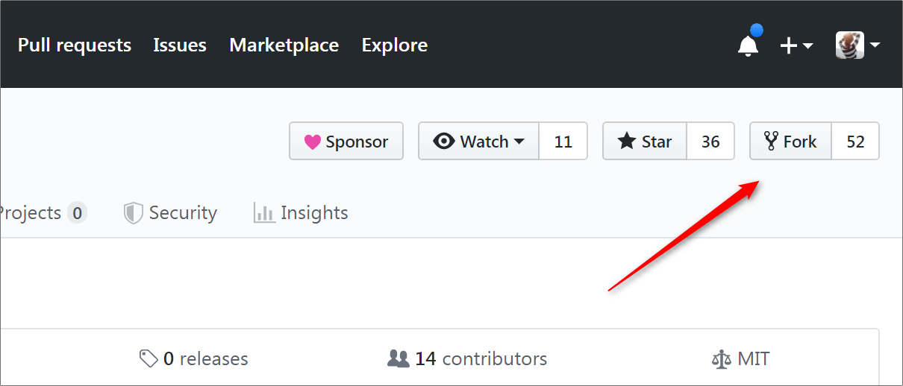
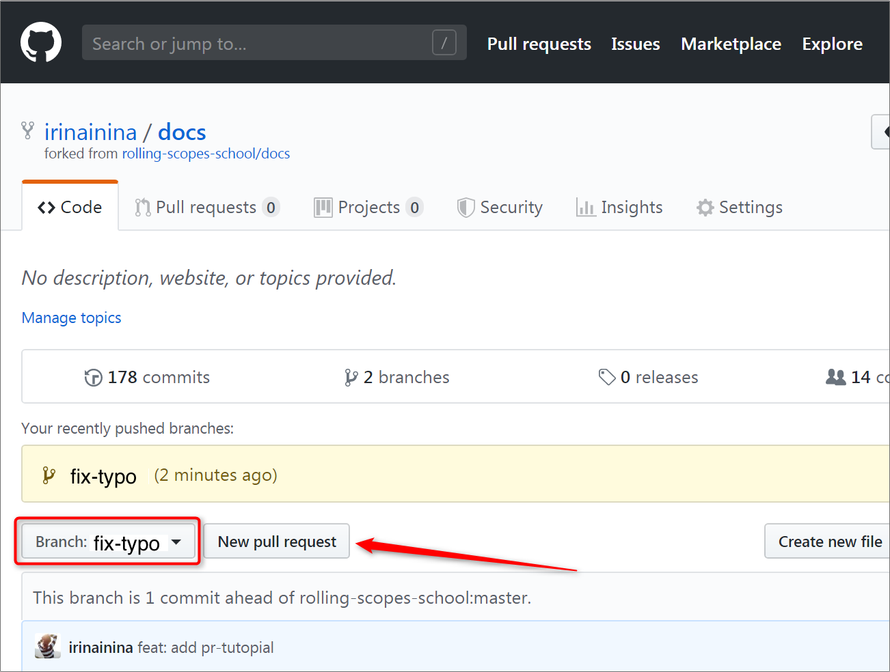
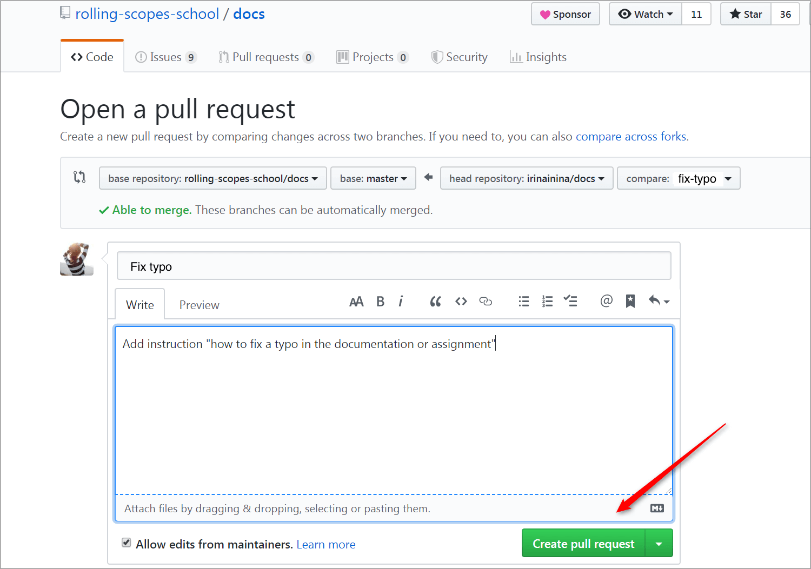

# How to Make Changes to RS School Documentation

If you notice an inaccuracy or typo in the [school documentation](https://docs.rs.school/#/), or in an assignment description, it's advisable to fix it.

The documentation repository is [here](https://github.com/rolling-scopes-school/docs)

If necessary, you can discuss changes in an issue, [for example](https://github.com/rolling-scopes-school/docs/issues/33).
But if the content of the fixes is obvious to you, it's better to create a **Pull Request**.

## How to Add Changes to Someone Else's Repository

By sending a Pull Request, you're proposing to the repository author and all interested parties to review the changes you've made and merge them into the project. If the changes are reasonable and appropriate, your Pull Request will be accepted.

I'll show you how to do this using the example of the repository https://github.com/rolling-scopes-school/docs

### 1. Make Your Own Copy of the Repository

To do this, click the "Fork" button on the repository page.



As a result, a copy of the repository appears in your account.


The address of your repository copy contains your GitHub account name.

- Original repository `https://github.com/rolling-scopes-school/docs`
- Created copy `https://github.com/irinainina/docs`

### 2. Clone Your Own Copy of the Repository to Your Computer

```sh
git clone https://github.com/irinainina/docs
```

## 3. Link the Local Copy to the Original Repository

To do this, go to the cloned repository folder and run two commands:

```sh
git remote add upstream https://github.com/rolling-scopes-school/docs
git fetch upstream
```


### 4. Create Your Own Development Branch

The branch name usually indicates the content of the edits. Let's assume our branch will be called `fix-typo`. The command to create a new branch `fix-typo` and make it active:

```sh
git checkout -b fix-typo
```

At this point, we can already edit the code and add the necessary changes to it.

### 5. Add Changes to Your Own Copy of the Repository

As soon as you've done the work (or part of it), send it to your own copy of the repository on GitHub.
To do this, run the commands:

```sh
git add .
git commit -m "feat: add fix-typo"
git push origin fix-typo
```

### 6. Return Changes: Pull request

So, everything is done. You've written the code, it's in your `fix-typo` branch both on your computer and on GitHub. All that's left is to send it to the original repository.

Go to your repository copy page on GitHub, select the `fix-typo` branch and click the Pull Request button.


Add a title and description of your changes and click the "Create pull request" button.


### What's Next?

Follow your Pull Request. See what people comment, what the maintainer says, whether they accept or reject your proposed edits.

Using the same principle, you can fix errors in the [course assignments repository](https://github.com/rolling-scopes-school/tasks) or even propose your own tasks.

Only the repository name will change, but the principle of working with the repository remains unchanged. Because it's the foundation of collaborative work on GitHub and creating open-source projects.

[Source](https://habr.com/ru/post/125999/)

