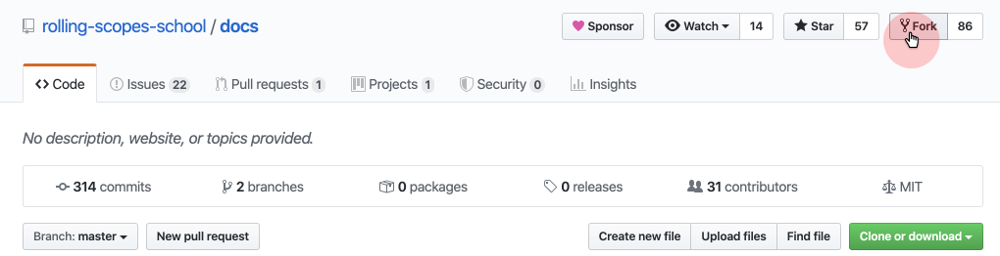
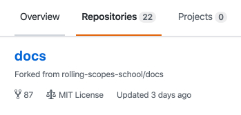
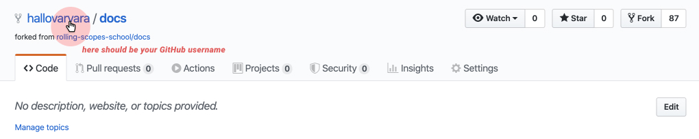
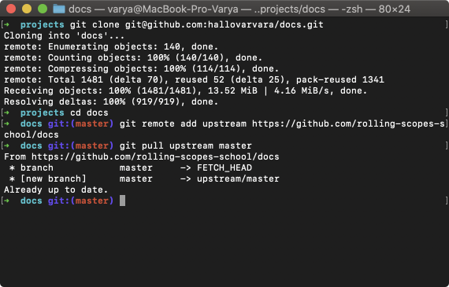
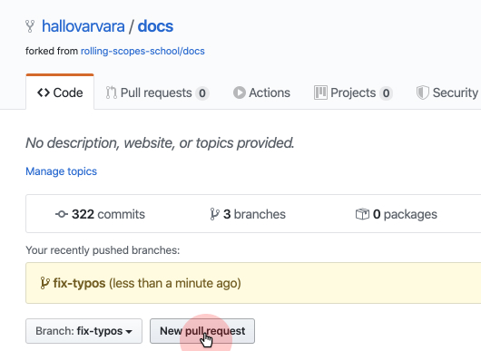
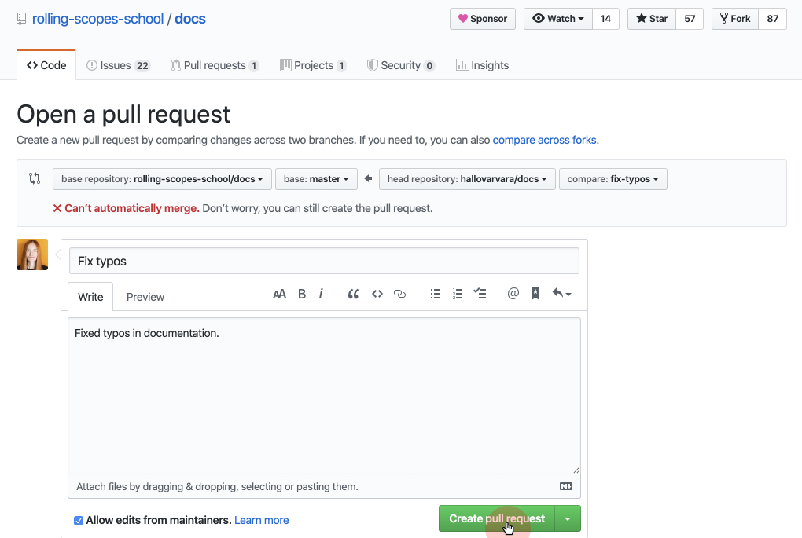

# How to edit RS School documentation

If you see inaccuracies or typos in the documentation or course tasks, please correct them.

Documentation repository:  
https://github.com/rolling-scopes-school/docs

You can make an issue ([example](https://github.com/rolling-scopes-school/docs/issues/101)) to discuss corrections. But when they are obviously needed, it's better to make it and create Pull Request to school repository.

## How to add corrections to others repository

Creating Pull Request, you offer the repository owner and the others involved to review your corrections. And add them to the project, if they're reasonable.

### 1. Make your own copy of repo by pressing **Fork** button

You will find the copy in your account among the others repositories.

The copy's address contains your GitHub username, for example:
- Original: https://github.com/rolling-scopes-school/docs 
- The copy: https://github.com/yourusername/docs

### 2. Clone your copy to computer:
`git clone https://github.com/yourusername/docs`
if you set up SSH, better use this command:
`git clone git@github.com:yourusername/docs.git`

### 3. Link local copy and original in project folder:
`cd docs`  
`git remote add upstream https://github.com/rolling-scopes-school/docs`  
`git pull upstream master`

### 4. Create branch for your corrections
Branch name should clearly describe changes. Like if you want to fix typos, let's name be „fix-typos” or so:
`git checkout -b fix-typos`  

### 5. Make corrections and add them to your copy of the repository
`git add .`  
`git commit -m 'feat: add fix-typos'`  
`git push origin fix-typos`

### 6. Create Pull request
So, you made corrections in your branch locally, pushed to GitHub. You're almost there! Open in browser page of the repository's copy. Choose branch, where you made corrections and press **Pull Request** button.

Name and describe your corrections. Press **Create pull request** button.

## What's next?

Monitor your Pull Request for discussion and approving or rejecting corrections.  

In the same way fix tasks or propose your own in school repository:  
https://github.com/rolling-scopes-school/tasks

It's the fundamental concept of GitHub collaboration and creation of open-source projects.

## Additional Information
[GitHub Docs: Fork a repo](https://help.github.com/en/github/getting-started-with-github/fork-a-repo)  
[GitHub Docs: About Pull Requests](https://help.github.com/en/github/collaborating-with-issues-and-pull-requests/about-pull-requests)