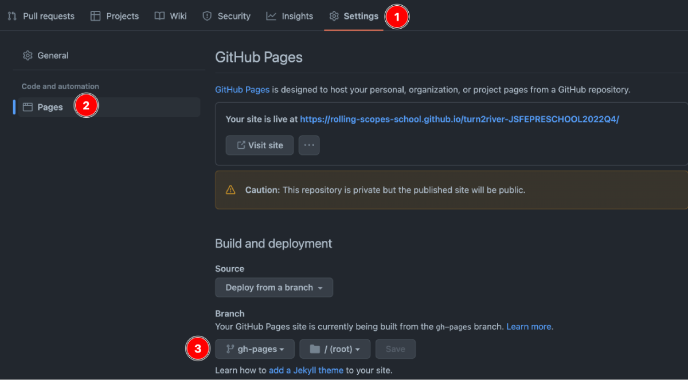

# Private Repository

## How to create your private repository in RS School?

At the beginning of the course, you need to:

- open `Dashboard` in [RS App](https://app.rs.school)
- click "Create repository" (or "Fix repository" if repository settings need to be reset to initial state)
- GitHub automatically sends you an invite to access the repository. The invite comes to the email you specified when registering on GitHub (not the email you specified in RS App)

## How to work with a private repository?

- Clone it to your computer:
  `git clone https://github.com/rolling-scopes-school/<your-school-repository>.git`
- Go to the cloned repository folder:
  `cd <your-school-repository>`
- Set your data in the config (enter the email linked [to your GitHub account](https://github.com/settings/emails)):
  `git config user.name "Name Surname"`
  `git config user.email "your@email"`
- Create a branch from `main` with the assignment name:
  `git checkout -b <task-name>`
- Create a folder with the assignment name:
  `mkdir <task-name>`
  All files related to the assignment should be in it.
- Complete the assignment, committing solutions in the process (see [commit requirements](https://docs.rs.school/#/git-convention)).
- Push the branch to the remote branch on GitHub:
  `git push origin <task-name>`
- Create a Pull Request from branch `<task-name>` to branch `main`. You don't need to merge the Pull Request.

## How to deploy an assignment from the school's private repository?

1. In the `gh-pages` branch, you need to place a folder with the assignment name, and the project files in it. The `index.html` file should be at the top level. This can be done in two ways:
   - for projects that don't use `webpack`, it's enough to make a Pull Request from the development branch to the `gh-pages` branch and merge it.
   - for projects that use `webpack`, you need to create a project build by running the `npm run build` command, create a folder with the assignment name in the `gh-pages` branch, and place the built project files in the created folder. Note that the `.gitignore` file lists the names of folders created during application build. Therefore, in the `gh-pages` branch, the `.gitignore` file can be deleted.
2. The link to the deployed application version looks like: `https://rolling-scopes-school.github.io/repository-name/folder-name`, where
   - `repository-name` - your repository name in rs school
   - `folder-name` - the folder name with project files
3. All other projects are deployed this way, a separate folder is created for each of them
   - this is how the `gh-pages` branch [looks](https://docs.rs.school/images/deploy-to-gh-pages.png) with project folders
   - example link: `https://rolling-scopes-school.github.io/irinainina-JS2020Q3/repair-design-project/`

#### Video&nbsp;[Deploy to GitHub Pages](https://www.youtube.com/watch?v=0lvKcqP3aP0)

## FAQ

### I deleted the gh-pages branch, what should I do?

1. Create the `gh-pages` branch from `main` again and push it to your school private repository
2. In `Dashboard` RS App, click the `Fix repository` button
3. Make any commit to the `gh-pages` branch and push the changes. (Each push to `gh-pages` triggers the deployment mechanism for this branch)
4. Wait 5 minutes

### I can't open/merge a Pull Request from the development branch to the gh-pages branch, what should I do?

1. Delete the `gh-pages` branch on GitHub
2. In `Dashboard` RS App, click the `Fix repository` button
3. Merge the Pull Request into the `gh-pages` branch

### My site is not deploying and the Deployments section is not appearing, what should I do?

- Go to the settings of the private repository and check/set the required branch for deployment: `gh-pages/root`
- If there's no settings section, in `Dashboard` RS App, click the `Fix repository` button, settings should appear.

## Adding a list of completed assignments and contacts to the private repository

The created private repository already has a `readme.md` file with the repository name.
You can add your contacts (or a link to CV with contacts) to this file and maintain a list of completed assignments in it. This will help reviewers find your work in case of an error during submission.

After creating the `gh-pages` branch from `main`, this file will be copied there and will be available at
`https://rolling-scopes-school.github.io/<repository-name>/`

