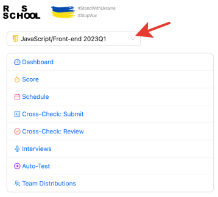
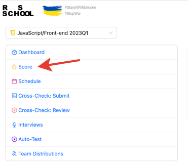
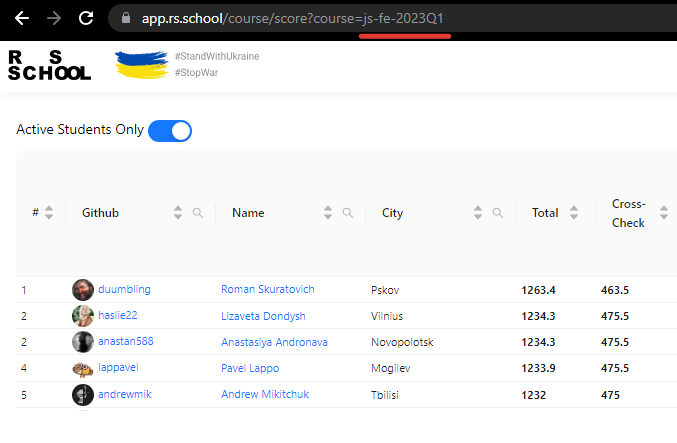
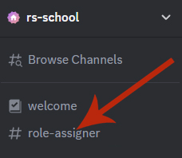
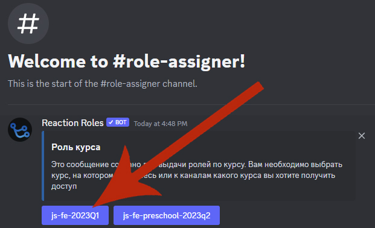

## Discord

- [Discord Registration](https://discord.com/channels/516715744646660106/747714817845887036/1072965806566158446)
- Official languages: RU, EN, BE.
- Your Discord nickname should contain your GitHub username after `@` and look like this: `Paval Miatlitski (@pavalEscoba)`. Instructions for adding a GitHub account to Discord:

- Only the topic specified in the channel name is discussed in the channel, for example, **#live-coding** is intended **exclusively** for discussing live streams. Off-topic posts will be deleted. Channel purposes are listed below.
- Use search and pinned messages.
- When replying to someone, it's better to reply to their message (RMB - Reply).
- Be polite, don't overdo trolling, and everything will be fine.
- In school chats, respectful "you" (ты) is used.

### Discord Categories

1. Chat channels are grouped by categories.
2. For each school student cohort - a separate category in Discord. For example, for cohort `RSSchool 2024Q4` - `RS2024Q4`.
3. The category is created together with the cohort start.
4. Discord allows you to collapse and mute all channels from a category.
5. For each channel in the category, a channel topic is set, containing information about the channel.
6. You need to get a role for the current course in the [#role-assigner channel](https://discord.com/channels/516715744646660106/1120291411259035698/1120349319384535101), which will allow you not to miss important announcements.

To select the correct role in #role-assigner, go to [RS APP](https://app.rs.school/), select your current course:

Go to Score:

Remember which course is indicated in the link:

Go to the [#role-assigner channel](https://discord.com/channels/516715744646660106/1120291411259035698/1120349319384535101) in Discord and click on the corresponding selection button (you can unsubscribe from the role by clicking it again).

### Discord Chat Map

#### Category `RS2024Q4`

Category format: `RSYYYYQQ`, where YYYY is the start year, and QQ is the start quarter, for example winter (Q1) or fall (Q3).
Channels:

- **#announcements** - The most important and relevant information is posted on this channel. All announcements, as well as any important comments about the educational process, class rescheduling, new assignments, we write to this channel. Therefore, we recommend checking news and announcements at least once a day. This way you won't miss anything! You can also subscribe to notifications about new messages. This can be done in the channel settings.
- **#live-streaming** - communication during webinars and live streams
- **#materials** - slides, books, etc., without discussion
- **#students-introduction** - chat where students can tell about themselves and their motivation to learn programming
- **#questions** - main channel for questions not related to solving assignments
- **#git** - questions about git
- **#tests** - discussion of tests on HTML/CSS/JS/GIT/RSSchool
- **.................** - other channels by assignment name

#### Category `General`

- **#questions-to-admins** - channel for the most important questions that only course admins can answer
- **#questions-to-rsapp** - channel for critical questions about rs app work
- **#rsapp-development** - channel for discussing RS App features
- **#moderation** - channel about moderation
- **#tasks-review**
- **#gratitude** - channel for gratitude to students/lecturers/mentors/activists/everyone you want to thank. Gratitude sent through [RS APP](https://app.rs.school/gratitude) is duplicated here
- **#proposals** - student proposals for improving The Rolling Scopes School. It's best to duplicate the proposal text in the [feedback form](https://docs.google.com/forms/d/e/1FAIpQLSeN-OYDhazcs7WhZi_oae-u8bCLuVcsksCeZkYcfRMMwj3eJA/viewform)
- **#proposals-discussion** - discussion of proposals for improving the educational process and school applications

#### Category `Random`

- **#random** - main channel "about everything"
- **#место-для-флуда**
- **#random-свободный-от-учебы**
- **#interesting-links** - self-development, motivation and other interesting articles not related to current school tasks
- **#fun** - memes, jokes
- **#english** - channel for practicing English. You can also join the [Practice English](https://discord.gg/mZdYun6) server
- **#pc-builds**
- **#workspace** - in this channel we discuss software, plugins, operating systems, configs, etc.
- [**#mentoring**](rs-school-mentor.md)

#### Category `Opportunities`

- **#freelance**
- **#job**
- **#success-stories** - channel where RS School students can motivate other students and share their experience of successfully completing RS School
- **#epam-js-lab**

## List of RS School Discord Servers

- [JavaScript/Front-end Course](https://discord.com/invite/QvEYg7EaQ4)
- [JavaScript/Front-end in English Course](https://discord.com/invite/uW5cCHR)
- [React Course](https://discord.com/invite/zyRcphs3px)
- [Angular Course](https://discord.com/invite/xwReXYqvs7)
- [NodeJS Course](https://discord.com/invite/8BFb8va)
- [AWS Courses](https://discord.com/invite/WEZxwRa4J6)

## Youtube

- [Rolling Scopes School](https://www.youtube.com/channel/UC578nebW2Mn-mNgjEArGZug) - channel where we post recordings of lectures, webinars and streams from all our courses
- [The Rolling Scopes](https://www.youtube.com/therollingscopes) - channel where we post talks from our meetups and conferences

## Telegram

We use telegram channels for:

- Discussing events related to your city. For example, offline lectures
- Informal communication of students from one location

|                 Belarus                  |                       Russia                       |                      Kazakhstan                       |                     Ukraine                     |
| :--------------------------------------: | :------------------------------------------------: | :---------------------------------------------------: | :---------------------------------------------: |
| [Belarus General](https://t.me/RSSBands) |   [Russia General](https://t.me/RSSchoolRussia)    | [Kazakhstan General](https://t.me/RSSchoolKazakhstan) | [Ukraine General](https://t.me/RSSchoolUkraine) |
|   [Minsk](https://t.me/RSSchoolMinsk)    |       [Moscow](https://t.me/RSSchoolMoscow)        |         [Almaty](https://t.me/RSSchoolAlmaty)         |                                                 |
| [Mogilev](https://t.me/RSSchoolMogilev)  |    [St.Petersburg](https://t.me/RSSchoolSaintp)    |      [Karaganda](https://t.me/RSSchoolKaraganda)      |                                                 |
| [Vitebsk](https://t.me/RSSchoolVitebsk)  |      [Izhevsk](https://t.me/RSSchoolIzhevsk)       |     [Nur-Sultan](https://t.me/RSSchoolNurSultan)      |                                                 |
|   [Homel](https://t.me/rsschool_homel)   |       [Ryazan](https://t.me/RSSchoolRyazan)        |                                                       |                                                 |
|   [Brest](https://t.me/RSSchool_Brest)   |       [Samara](https://t.me/RSSchoolSamara)        |                                                       |                                                 |
|                                          |      [Saratov](https://t.me/RSSchoolSaratov)       |                                                       |                                                 |
|                                          | [Sergiev Posad](https://t.me/RSSchoolSergievPosad) |                                                       |                                                 |
|                                          |    [Togliatti](https://t.me/RSSchoolTogliatti)     |                                                       |                                                 |
|                                          |         [Tver](https://t.me/RSSchoolTver)          |                                                       |                                                 |
|                                          |     [Nizhny Novgorod](https://t.me/RSSchoolNN)     |                                                       |                                                 |
|                                          |    [Volgograd](https://t.me/RSSchoolVolgograd)     |                                                       |                                                 |

|                      Uzbekistan                       |                       Kyrgyzstan                       |                        Poland                        | Lithuania                                                  |
| :---------------------------------------------------: | :----------------------------------------------------: | :--------------------------------------------------: | ---------------------------------------------------------- |
| [Uzbekistan General](https://t.me/RSSchoolUzbekistan) | [Kyrgyzstan General](https://t.me/RSSchool_Kyrgyzstan) | [RS School Poland [RU]](https://t.me/RSSchoolPoland) | [RS School Lithuania [RU]](https://t.me/RSSchoolLithuania) |

## FAQ

### What should you do before asking a question in the chat?

- Try to google the question
- Read previous messages in the chat, maybe this question was asked and there's already an answer

### What to do if you're doing everything right, but something doesn't work?

- Create a minimal example on [codepen.io](https://codepen.io/) or [jsfiddle.net](https://jsfiddle.net), provide a list of already checked options and ask for help in the questions channel

### How should the nickname look in the Discord chat of the school?

- In the format: discord-nickname(@GitHub-username)

### How to change the nickname in the Discord chat of the school?

- Call the menu by right-clicking on the chat icon and select the menu item "Server Profile Settings", then change the value in the "NICKNAME" field

### In which channel should you ask questions about Git?

- In #git.

### In which channel should you ask general questions?

Questions that don't fit into special channels like #git/#tests/#live-coding/#core-js-tasks, etc., please ask in:

- Discord channel #questions or #random

### In which channel is it better to thank for help?

- Gratitude should be sent through the [RS APP](https://app.rs.school/gratitude) application. It will remain in the recipient's profile and will be duplicated in #gratitude

### Can I post torrent links in the chat?

- No

## School Feedback

Anonymous feedback, complaints or enthusiastic reviews, please send [here](https://docs.google.com/forms/d/1F4NeS0oBq-CY805aqiPVp6CIrl4_nIYJ7Z_vUcMOFrQ/viewform)

