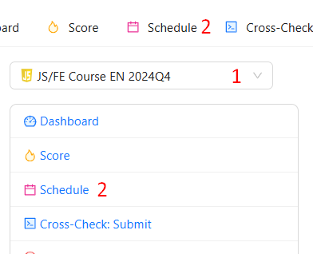
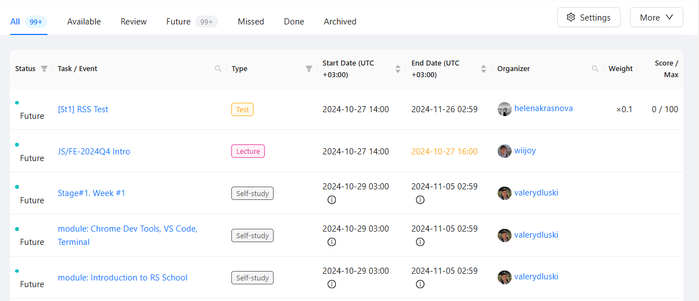
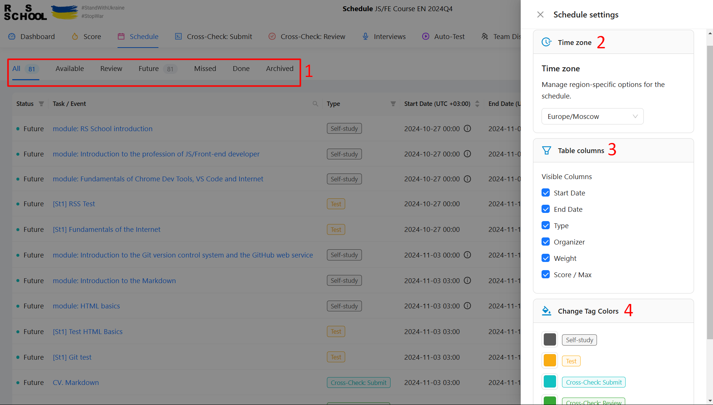

## Расписание в RS APP

Для успешного прохождения выбранного курса в **RS App** есть **расписание**, в которое можно попасть из главного меню

1. Выбрать нужный курс
2. Перейти по ссылке или вкладке Schedule

#### Общий вид расписания

#### Панель управления расписанием

1. Фильтрация по статусу задания
2. Выбор часового пояса
3. Скрыть/показать отдельные колонки таблицы
4. Настройка цветов тегов событий

#### Детали события/задания

При переходе по ссылке из расписания открывается страница с описанием события/задания.

#### Использование расписания

Для удобного использования расписания в RS App предусмотрены следующие возможности:

1. Фильтрация по статусу задания
2. Поиск по названию события/задания
3. Фильтрация по типу задания
4. Сортировка по дате выдачи задания
5. Сортировка по дате окончания задания
6. Поиск по организатору

<!-- TBD: check later -->

<!-- ### Дополнительные возможности расписания для администрации

Для максимального удобства работы с расписанием предусмотрены следующие возможности редактирования расписания:

1. Расширенная панель управления

    **1** - Кнопка экспорта расписания курса в файл csv для редактирования целого курса
    **2** - Кнопка импорта расписания курса из файла csv (добавляются новые или обновляются существующие события/задания)
    **3** - Кнопка добавления единичного события/задания

2. Быстрое редактирование для вида **Table**

3. Добавление нового события/задания

4. Редактирование события/задания также доступно на странице деталей события/задания

#### Некоторые особенности заполнения расписания

- Основные поля в событиях/заданиях изменяются сразу **во всех курсах**. Например, **Name**, **Type**, **Url**.

- Поле **Special** позволяет дополнительно уточнить тип события/задания. Например, сделать его опциональным с помощью тега _optional_. Допустимо добавлять теги не только из предусмотренного списка. -->
