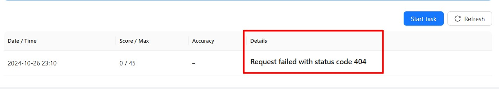

## Rolling Scopes School Application
Rolling Scopes School Application, или RS APP, — это open-source платформа, используемая в процессе обучения в RS School и разрабатываемая силами активистов сообщества.

Ссылки:
- http://app.rs.school/
- https://github.com/rolling-scopes/rsschool-app

## Алгоритм действий «Что делать, если что-то не работает в RS APP?»
1. Сперва проверьте, возможно кто-то уже описал эту проблему в https://github.com/rolling-scopes/rsschool-app/issues. Если проблема описана, вам достаточно оставить в соответствующем issue комментарий о том, что проблема актуальна и для вас. Если похожей проблемы нет, перейдите к пункту 2.
2. Спросите о проблеме в соответствующем discord-канале (у всех заданий есть свой канал). Подождите ответа других студентов/активистов. Если проблема не решена, перейдите к пункту 3.
3. Спросите о проблеме в discord-канале **#questions-to-rsapp**. Дождитесь комментариев активистов/админов. Если проблема не решена, перейдите к пункту 4.
4. Создайте новый issue c описанием проблемы в репозитории https://github.com/rolling-scopes/rsschool-app/issues

## Типичные проблемы и их решения

1. Нет доступа к курсу, ошибка **"No access"**

    

    **Решение:** зарегистрируйтесь на нужный курс, используя ссылку [https://app.rs.school/registry/student](https://app.rs.school/registry/student)

2. Не знаю, как увидеть свои ошибки в задании с автоматической проверкой (**Auto-test**)

    **Решение:** зайдите на [https://app.rs.school/](https://app.rs.school/) и перейдите в раздел **Auto-test**, и в выпадающем списке выберите интересующее задание. Детали проверки будут отображаться в столбце **Details** таблицы **Verification Results**:

    

3. Я сдал задание и получил баллы, но в **score** изменений нет.

    **Решение:** подождите. Для того чтобы изменения отобразились, нужно немного времени — обычно это занимает 5 минут.

## Уникальная возможность улучшить свою карму прямо сейчас
1. Откройте репозиторий https://github.com/rolling-scopes/rsschool-app
2. Нажмите кнопку **:star:  Star**
3. Поздравляем, ваша RS School карма улучшилась :innocent:
