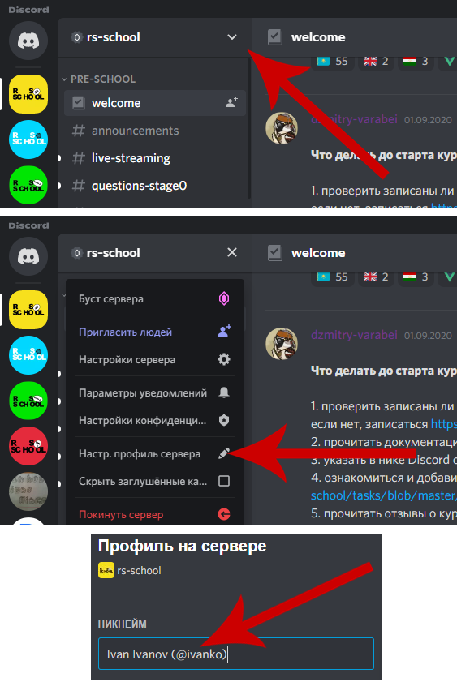

## Discord
* [Регистрация в Discord](https://discord.gg/PRADsJB)
* Официальные языки: RU, EN, BE.
* Ваш ник в Discord должен содержать название вашего GitHub аккаунта. Например, вот так - Paval Miatlitski (@pavalEscoba). Инструкция по добавлению аккаунта GitHub в Discord:
    
  
    
* В канале обсуждается только указанная в его названии тематика, например, **#live-coding** предназначен __исключительно__ для обсуждений live-стримов. Нетематические посты будут удаляться. Назначение каналов указано ниже.
* Используйте поиск и pinned messages.
* Отвечать человеку желательно через mention (@nicknamehere).
* Будьте вежливы, не перегибайте с троллингом, и все будет хорошо.
* В чатах школы принято уважительное обращение "на ты".

### Категории в Discord
1. Каналы чата сгруппированы по категориям.
2. Для каждого набора студентов школы - отдельная категория в Discord. Например, для набора `RSSchool 2022Q1` - `RS2022Q1`.
3. Категория создается вместе со стартом набора.
4. Discord позволяет сворачивать и мьютать все каналы из категории.
5. Для каждого канала в категории прописан - channel topic, содержащий информацию о канале.

### Карта чата в Discord
#### Категория `RS2022Q1`
Формат категории: `RSYYYYQQ`, где YYYY год старта, а QQ квартал старта, например зима (Q1) или осень (Q3).
Каналы:
- **#announcements** - На этом канале размещается самая важная и актуальная информация. Все объявления, а также любые важные комментарии по учебному процессу, переносу занятий, новым заданиям мы пишем в этот канал. Поэтому рекомендуем проверять новости и анонсы минимум раз в день. Так вы точно ничего не упустите! Также можно подписаться на уведомления о новых сообщениях. Это можно сделать в настройках канала.
- **#live-streaming** - общение во время вебинаров и лайв трансляций
- **#materials** - слайды, книги и т.д, без обсуждения
- **#students-introduction** - чат в котором студенты могут рассказать о себе и своей мотивации изучать программирование
- **#questions** - главный канал для вопросов, не относящихся к решению заданий
- **#git** - вопросы по git
- **#tests** - обсуждение тестов по HTML/CSS/JS/GIT/RSSchool
- **#markup-tasks** - обсуждение тасков по верстке
- **#algorithmic-tasks** - обсуждение алгоритмических тасков
- **#stage1-interview**
- **.................**
- **.................**

#### Категория `Opportunities` 
- **#community-lab**
- **#epam-js-lab**
- **#work-intership**
- **#sap-js-frontend**
- **#freelance**

#### Категория `General`
- **#questions-to-admins** - канал для самых важных вопросов на которые могут ответить только админы курса
- **#questions-to-rsapp** - канал для критичных вопросов о работе rs app
- **#random** - главный канал "про всё"
- **#moderation** - канал о модерации
- **#fun** - мемы, шутеечки
- **#gratitude** - канал для благодарностей студентам/лекторам. Менторы его читают). Сюда дублируются благодарности отправленные через приложение RS APP
- **#english** - use this in case you want to discuss some task in English. There’s a separate [server](https://discord.gg/mZdYun6) for general English practice where we chat about everything
- **#proposals** - предложения студентов по улучшению The Rolling Scopes School. Лучше всего дублировать текст предложения в [форму фидбека](https://docs.google.com/forms/d/e/1FAIpQLSeN-OYDhazcs7WhZi_oae-u8bCLuVcsksCeZkYcfRMMwj3eJA/viewform)
- **#rs-padawans-developing**:lock:
- **#rs-activist**:lock:

## Список Discord серверов RS School
- Курс «JavaScript/Front-end» https://discord.com/invite/QvEYg7EaQ4
- Курс «React» https://discord.com/invite/zyRcphs3px
- Курс «Angular» https://discord.com/invite/xwReXYqvs7
- Курс «NodeJS» https://discord.com/invite/8BFb8va
- Курс «NodeJS in AWS» https://discord.com/invite/8BFb8va
- Курс «Разработка приложений для Android» https://discord.com/invite/AzKUfTZ
- Курс «Разработка приложений для iOS» https://discord.com/invite/HCmpatx
- Курс «Введение в машинное обучение» https://discord.gg/EaqnbAAUps
- Курс «JavaScript/Front-end in English» https://discord.com/invite/uW5cCHR
- Курс «Javascript/Front-end Mentoring Program in Lithuania» https://discord.com/invite/pm9Ch2NhvA

## Youtube
- [Rolling Scopes School](https://www.youtube.com/channel/UC578nebW2Mn-mNgjEArGZug) - канал на который мы выкладываем записи лекций, вебинаров и стримов со всех наших курсов
- [The Rolling Scopes](https://www.youtube.com/therollingscopes) - канал на который мы выкладываем выступления с наших митапов и конференций

## Telegram
Мы используем telegram каналы для:
- Обсуждения мероприятий, относящихся к вашему городу. Например, офлайн лекции
- Неформального общения студентов из одной локации

### Belarus
- [Belarus General](https://t.me/RSSBands)
- [Minsk](https://t.me/RSSchoolMinsk)
- [Mogilev](https://t.me/RSSchoolMogilev)
- [Vitebsk](https://t.me/RSSchoolVitebsk)
- [Homel](https://t.me/rsschool_homel)
- [Brest](https://t.me/RSSchool_Brest)

### Russia
- [Russia General](https://t.me/RSSchoolRussia)
- [Moscow](https://t.me/RSSchoolMoscow)
- [Izhevsk](https://t.me/RSSchoolIzhevsk)
- [Ryazan](https://t.me/RSSchoolRyazan)
- [Samara](https://t.me/RSSchoolSamara)
- [Saratov](https://t.me/RSSchoolSaratov)
- [Sergiev Posad](https://t.me/RSSchoolSergievPosad)
- [Togliatti](https://t.me/RSSchoolTogliatti)
- [Tver](https://t.me/RSSchoolTver)
- [St.Petersburg](https://t.me/RSSchoolSaintp)
- [Nizhny Novgorod](https://t.me/RSSchoolNN)
- [Volgograd](https://t.me/RSSchoolVolgograd)

### Uzbekistan
- [Uzbekistan General](https://t.me/RSSchoolUzbekistan)

### Kyrgyzstan
- [Kyrgyzstan General](https://t.me/RSSchool_Kyrgyzstan)

### Kazakhstan 
- [Kazakhstan General](https://t.me/RSSchoolKazakhstan)
- [Almaty](https://t.me/RSSchoolAlmaty)
- [Karaganda](https://t.me/RSSchoolKaraganda)
- [Nur-Sultan](https://t.me/RSSchoolNurSultan)

### Ukraine 
- [Ukraine General](https://t.me/RSSchoolUkraine)

### Poland
- [RS School Poland на русском](https://t.me/RSSchoolPoland)

### Lithuania
- [RS School Lithuania на русском](https://t.me/RSSchoolLithuania)

## FAQ
### Что нужно сделать перед тем как задать вопрос в чате?
- Попробовать загуглить вопрос
- Прочитать предыдущие сообщения в чате, может быть этот вопрос задавали и на него уже есть ответ

### Что делать, если вы всё делаете правильно, но у вас что-то не получается?
- Сделать минимальный пример на [codepen.io](https://codepen.io/) или [jsfiddle.net](https://jsfiddle.net), привести список уже проверенных вариантов и попросить помочь в канале вопросов

### Как должен выглядеть ник в Discord-чате школы?
- В формате: discord-nickname (@GitHub-username)

### Как поменять ник в Discord-чате школы?
- Вызвать меню нажатием правой кнопки мыши на иконке чата и выбрать пункт меню "Настр. профиль сервера", затем изменить значение в поле "НИКНЭЙМ"

### В каком канале следует задавать вопросы по Git?
В #git-help.

### В каком канале следует задавать вопросы общего плана?
Вопросы, не подходящие для специальных каналов вроде #git-help / #padawanshelp / #live-coding задавайте, пожалуйста, в:
- Telegram
- В Discord канал #random

### Какие вопросы следует задавать в канале #programming-tasks-help?
- Любые вопросы по алгоритмическим таскам 1-го этапа

### В каком канале лучше поблагодарить за помощь?
- Благодарность нужно отправлять через приложение [RS APP](https://app.rs.school/gratitude). Она останется в профиле получателя и будет продублирована в #gratitude

### Можно ли давать ссылки на торренты в чате?
- Нет

## Фидбек о работе школы
Анонимный фидбек, жалобы или восторженные отзывы отправляйте, пожалуйста, [сюда](https://docs.google.com/forms/d/1F4NeS0oBq-CY805aqiPVp6CIrl4_nIYJ7Z_vUcMOFrQ/viewform)
