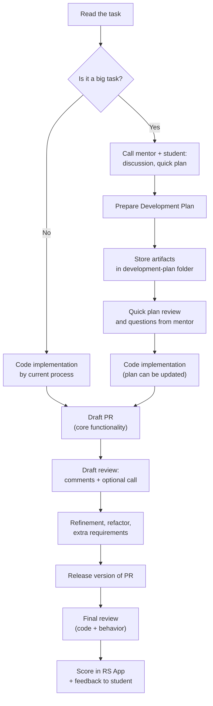

# Предложения по улучшению процесса проверки заданий

Документ описывает **дополнительные рекомендации** к существующему процессу проверки заданий:

- введение *Development Plan* для **крупных задач**;
- двухэтапный процесс ревью: *Draft* → *Release*;
- акцент на созвонах «сначала подумай, потом код».

Эти рекомендации **не отменяют** текущую официальную схему, а дополняют её.

---

## 1. Общая схема процесса



Ключевые новые элементы:

1. **Созвон и Development Plan до кода** — только для крупных заданий.
2. **Draft PR** — ранний срез решения, фокус на архитектуре и базовой функциональности.
3. **Release PR** — доработанная версия после Draft‑ревью.

---

## 2. Development Plan для больших заданий

### 2.1. Когда нужен

Development Plan **рекомендуется только для крупных заданий**, где:

* много функциональности и состояний;
* есть риск «закопаться» в переписывании архитектуры;
* ментору сложно качественно ревьюить всё сразу одним заходом.

Например: RSS Puzzle, большие SPA‑таски, финальные проекты.

### 2.2. Принципы и требования

Главное в Development Plan — **не красота документа, а понимание**:

* Студент **понимает, что изображено** в диаграммах и написано в тексте,
  а не просто вставляет текст и картинки, сгенерированные AI.
* Нам **не нужен формальный текст «для галочки»** или тупой копипаст из AI
  без осознания содержания.
* В идеале это **живой рабочий документ**, который родился **во время созвона**
  *ментор <> студент*: наброски, схемы, заметки, скриншоты доски и т.п.
* Все артефакты (md‑файлы, картинки, скриншоты, схемы) складываются в папку
  `development-plan` в корне задания.
* План **можно и нужно менять**, если в процессе стало ясно, что изначальное решение плохое.


Для нас важнее всего:

> **Сам факт обсуждения задачи с ментором до написания кода.**
> То, что вы созвонились, обсудили, спроектировали, задали вопросы и сверили понимание.

### 2.3. Супер‑минимальный шаблон Development Plan

Мы сознательно избегаем «монструозных RFC».
Ниже — минимальный шаблон `development-plan.md`, который студент может адаптировать.

```md
# Development Plan – <название задания>

## 1. Контекст и задача (2–3 абзаца)
Кратко:
- что за приложение;
- что должен уметь пользователь;

## 2. Основные сценарии
3–5 юзкейсов в формате:

- Пользователь делает X → ожидает Y.
- Пример: «выбирает уровень и страницу → видит набор предложений и картинку».

## 3. Архитектура / компоненты
- список ключевых модулей / страниц / компонентов и кто за что отвечает;
- как они взаимодействуют:
  - state manager / props / колбэки и т.п.;
  - где принимаются основные решения.

## 4. Данные / API
- какие сущности есть (User, Level, Puzzle, Card и т.д.);
- откуда берутся данные:
  - статический json / локальное состояние;
  - реальный API (если есть);
  - что и где кэшируем.

## 5. Риски и вопросы
- что кажется сложным прямо сейчас;
- какие части студент не до конца понимает или хотел бы обсудить с ментором.

```

Этого уже достаточно, чтобы:

* ментор понял, **что у студента в голове**;
* было, с чем сравнивать итоговый PR (план → реализация).

---

## 3. Двухэтапное ревью: Draft и Release

### 3.1. Draft PR

**Цель:** увидеть основную идею решения и архитектуру до того, как код разрастётся.

Рекомендуется:

* Студент создаёт Draft PR, когда:

  * реализована базовая функциональность;
  * структура проекта уже более‑менее устоялась;
  * дополнительные фичи могут ещё не быть сделаны.
* Ментор смотрит прежде всего на:

  * архитектуру и разбиение на модули;
  * работу со стейтом и данными;
  * критичные проблемы по читаемости и качеству кода.

Хорошая практика — короткий **созвон по Draft‑версии**: пройтись по приложению глазами «нового пользователя», вслух проговорить, что понятно/непонятно, и обозначить главные точки улучшения.

### 3.2. Release PR

**Цель:** финальная версия задания с учётом замечаний по Draft‑ревью.

* Студент:

  * дорабатывает функциональность;
  * исправляет фундаментальные замечания;
  * проводит рефакторинг.
* Ментор:

  * проверяет, как были учтены ключевые замечания;
  * оценивает финальное качество кода и поведения приложения по критериям задания;
  * выставляет итоговый скор в RS App и даёт финальный фидбек.

---
