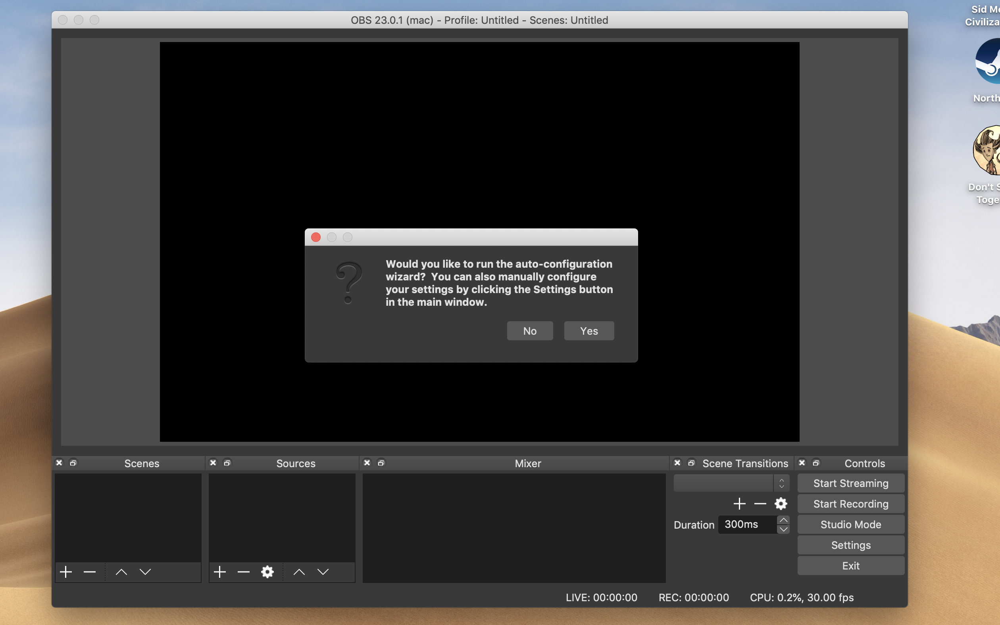
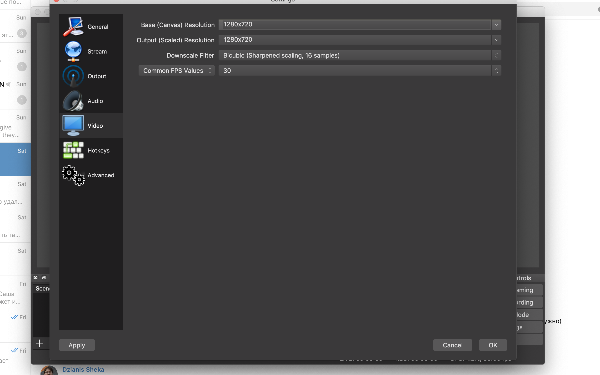
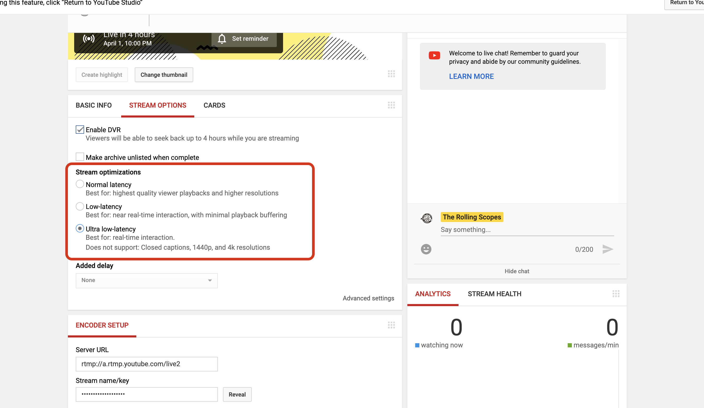
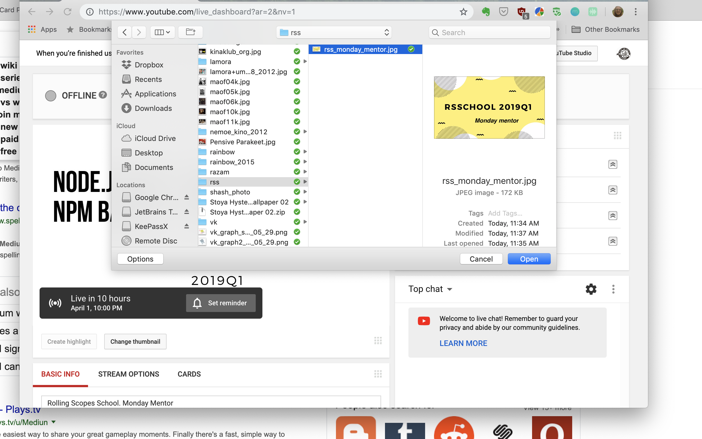

# Как настроить инструменты для стриминга

## Что нужно установить

- дискорд чтобы сделать анонс о лекции, скинуть ссылку на трансляцию и читать сообщения из лайф кодинг канала
- Open Broadcast Studio (OBS), чтобы захватывать экран, веб камеру и микрофон

Для трансляции достаточно иметь средний ноутбук с веб камерой и интернет скорости 3g и выше

## Настройка OBS

0. video 

<iframe width="560" height="315" src="https://www.youtube.com/embed/tys-IYIcYu8" frameborder="0" allow="accelerometer; autoplay; encrypted-media; gyroscope; picture-in-picture" allowfullscreen></iframe>

1. установить под свою систему https://obsproject.com/

1. настроить параметры стрима

2. настроить параметры выходного потока (чтобы сделать запись локально)

3. настроить сцену - добавить захват экрана, добавить веб камеру если нужно

5. проверить параметры видео и звука, начав запись локально

# Настройка параметров трансляции на ютубе

1. открыть дашборд лайф трансляции

1. выставить в stream options параметры задержки

2. выставить название стрима, описание и превью

3. скопировать ключ трансляции из дашборда стрима

