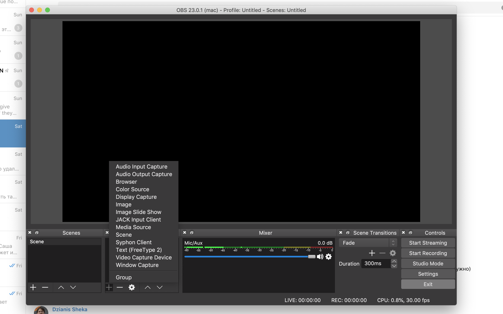

# Как настроить инструменты для стриминга

## Что нужно установить

- дискорд чтобы сделать анонс о лекции, скинуть ссылку на трансляцию и читать сообщения из лайф кодинг канала
- Open Broadcast Studio (OBS), чтобы захватывать экран, веб камеру и микрофон

Для трансляции достаточно иметь средний ноутбук с веб камерой и интернет скорости 3g и выше

## Настройка OBS

1. установить под свою систему https://obsproject.com/
2. настроить параметры стрима
3. настроить параметры выходного потока (чтобы сделать запись локально)
4. настроить сцену - добавить захват экрана, добавить веб камеру если нужно

5. проверить параметры видео и звука, начав запись локально

# Настройка параметров трансляции на ютубе

1. открыть дашборд лайф трансляции
2. выставить в stream options параметры задержки
3. выставить название стрима, описание и превью
